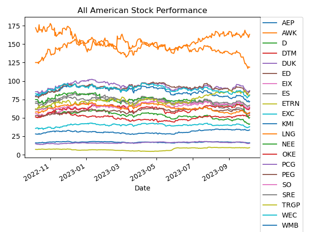
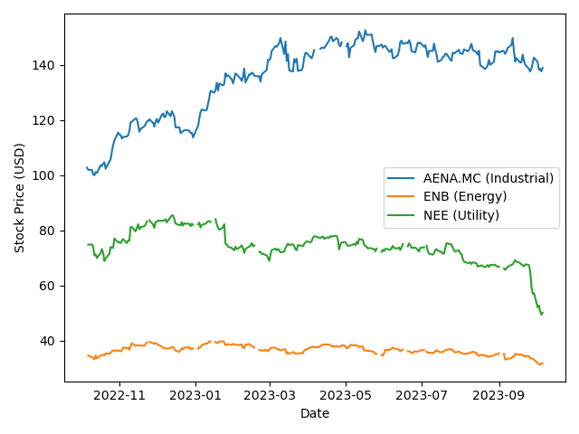
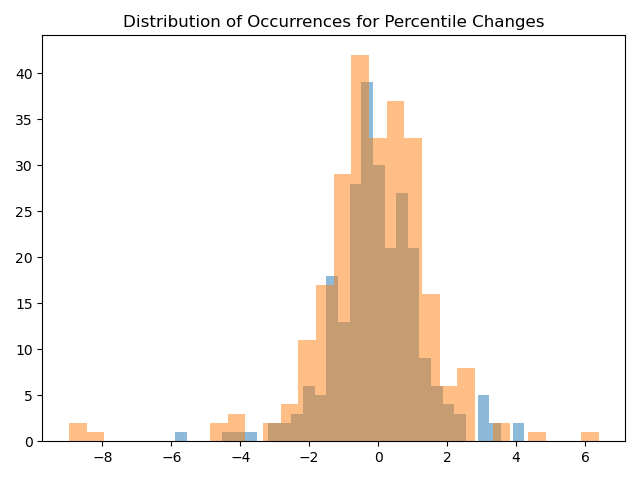
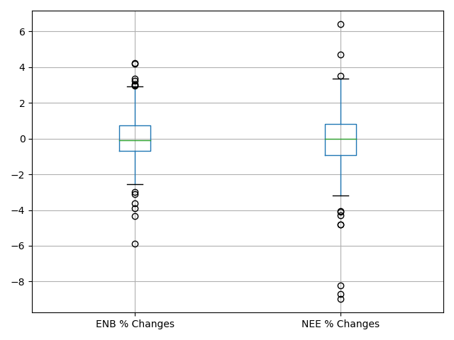

# Project 1 - Stock Sector Analysis

## Introduction

Using Python and libraries (yfinance, pandas, matplotlib, csv, and os), we performed a stock analysis on the iShares Global Infrastructure ETF (Ticker: IGF). The primary objectives of this analysis are to:
1.  Compare the performance of the top three stocks in the energy, utilities, and industrial sectors based on market value.
2.  Analyze the performance of the top three energy stocks based on market value.
3.  Perform statistical analysis to determine if energy and utility stocks are correlated.
4.  Visualize the performance of American stocks.
5.  Examine the distribution of market values by country.
6.  Visualize the sector makeup of the stock index.

## Sector Comparison for Top Three Stocks

This section identifies and compares the top-performing stocks in the energy, utilities, and industrial sectors based on market value. The code performs the following steps:

-   Reads a CSV file containing stock information.
-   Filters stocks by sector and identifies the top stock in each sector based on market value.
-   Retrieves historical stock data for the selected stocks and plots their price trends.

## Top 3 / Bottom 3 Energy Analysis

This section analyzes the performance of the top three energy stocks based on market value. It performs the following tasks:

Defines a list of top energy stock tickers. Use Yahoo Finance API (yfinance) to retrieve historical data for these energy stocks. Plots the closing price trends of the top three energy stocks over the past 12 months. Display the closing price data for the top three energy stocks.

```python
# Find the top three US energy stocks based on market value
top_energy_tickers = ['LNG', 'WMB', 'KMI' ]

# Get historical data with the energy tickers 
e_stocks = yf.Tickers(top_energy_tickers)

# Determine the previous 12 months of data 
energy_hist = e_stocks.history(period='12mo')

# Find the closing price 
top_close = energy_hist['Close']
```

## Statistical Analysis

In this section, the code conducts a statistical analysis to determine whether energy and utility stocks are correlated. The code performs the following steps:

-   Retrieves historical data for selected energy and utility stocks.
-   Calculates the daily percentage changes for each stock using the 'pct_change()' method. Multiply by 100 to express them as percentages.
- These percentage changes are stored in 'daily_enb' and 'daily_nee' for the respective stocks.

```python
for stock in stat_stocks:
    if stock == 'ENB':
        enb_column = stat_stocks_df['ENB']
        daily_enb = enb_column.pct_change()*100
    elif stock == 'NEE':
        nee_column = stat_stocks_df['NEE']
        daily_nee = nee_column.pct_change()*100
```
Then, use the SciPy library to conduct statistical tests. Perform a t-test (ttest_ind) and an ANOVA test (f_oneway) to evaluate the correlation between 'ENB' and 'NEE' stocks. The p-values obtained from these tests are printed to determine whether the stocks are correlated.
```python
import scipy.stats as st 
...
enb_changes = stat_pct_changes_df['ENB % Changes']
nee_changes = stat_pct_changes_df['NEE % Changes']

statistic_1, p_value_1 = st.ttest_ind(enb_changes, nee_changes)

print("The p_value for this statistical test is:", p_value_1)

statistic_2, p_value_2 = st.f_oneway(enb_changes, nee_changes)

print("The p_value for this second statistical test is:", p_value_2)
```

## Country Analysis Using Bar Graph

This section focuses on the performance of American stocks and presents a bar chart showing the relative market values of stocks from different countries. The code performs the following tasks:

-   Filters stocks based on their location (country).
-   Calculates the total market value for stocks from each country.
-   Plots a bar chart to visualize the relative market values by country.

## Performance By Sector Using Pie Chart

In this section, the code analyzes the sector makeup of the stock index and presents the data as a pie chart. The code performs the following tasks:

-   Calculates the total market value for stocks in each sector.
-   Excludes the "Cash and/or Derivatives" sector from the analysis.
-   Plots a pie chart to visualize the sector distribution within the stock index.

## Hypothesis Testing and Statistical Tests
1.	What country has the largest weight in the index? How are the stocks labeled under that country’s trending?
    -	Created a bar chart to compare the over-market capitalizations by country.
  
        
     	
    -	Plotted the closing prices of the largest country’s stocks on a line chart.
  
        

2.	What sectors make up the infrastructure? And how do their performances compare to each other? 
    -	Created a pie chart to show the percentage make-up of the index by sector.  

        
     	
    -	Plotted the closing prices of the largest stock (by market capitalization) in each sector to represent the entire sector within the index.  

        
     	
3.	After visualizing the performance of each sector, do any of them appear to be correlated? If so, is the correlation significant?
    -	The utilities sector and the energy sector appear to be trending in the same direction.
        -	Null Hypothesis: There is no significant correlation between the utilities sector and the energy sector. 
    -	Plotted the daily percentage difference in closing prices on a histogram to see if the distributions are “Normal.”   

     	

     	
     	
    -	Once determined to be “Normal,” we used the t-test to determine the p-value of the data. 
    -	If the data is > 0.05, then the correlation between the two sectors is insignificant, and the Null Hypothesis remains True. If < 0.05, then reject the Null Hypothesis.

## Statistical Analysis

1.	What country has the largest weight in the index? What is the trend of the stocks labeled under that country?
    -	The bar chart that shows the comparison of the market capitalizations by country shows that the United States far exceeds the weight of all the other countries represented within the index. This is most likely because the USA has the largest GDP in the world, which is a lagging economic indicator commonly influenced by a country’s infrastructure spending. In addition, the USA’s large GDP and overall economic environment create lower probabilities of systematic risks, which is attractive for companies and investors. Therefore, the index will include more USA-based companies because they appear “safer” to investors. 
    -	The factors estimated to make the index more weighted in USA stocks, don’t guarantee the performance of the stocks. And because the index weight is large, their performance heavily influences the overall share price of the index. That is why we plotted the closing prices of each USA stock on a line chart to visualize the technical trends that could potentially aid in predicting the price trend of the index. Based on the chart, it appears that most USA stocks are in a down trend, which could justify a negative outlook on the index's performance. 
2.	What sectors make up the infrastructure index? And how do their performances compare to each other? 
    -	Breaking the index down by sector weight allows us to predict the effect that certain market events have on the index’s performance. If the index were heavily weighted in any one sector, then it would also be heavily exposed to the risks associated with said sector. The pie chart we created shows the index’s percentage made up by sector. The industrial & utilities sectors are similar in weight and comprise most of the index (77.7% combined). The remaining smaller percentage is made up of the energy sector. The reason for how the index is weighted is most likely to do with risk exposure. Companies within the energy sector tend to involve the production of energy sources, such as oil, gas, and electricity. The prices of these raw materials are heavily influenced by global macroeconomic factors, which can cause uncertainty in their prices. Therefore, investors can see energy companies as “riskier” than utilities/industrial companies, more influenced by national micro-economic factors. 
    -	After determining the sector weights, the next step in the analysis would be to compare the overall performance of each sector. Due to time constraints, we chose the largest company by market capitalization within each sector to represent its sector’s performance. We compared the closing prices of each company for the last 12 months on a line chart so that technical trends were easily identifiable. Based on the chart, the utility sector (Ticker: AENA.MC) is in an uptrend, whereas the energy sector (Ticker: ENB) and the utility sector (Ticker: NEE) are both in down-trends. The performance of each sector could be a result of a variety of different factors that would require further analysis to determine. 
3.	After visualizing the performance of each sector, do any of them appear to be correlated? If so, is the correlation significant? 
    - Based on the previous line chart that compares the performance of the sectors within the index, the energy sector and the utilities sector are similar in the fact that they are both down-trending. Because of this, there is a probability that the same factors could influence the two sectors and, therefore, correlated. To test for statistical correlation, we will use the daily percentage change of the closing prices of the two sectors (represented by tickers ENB & NEE). By plotting the data on a histogram first, we were able to determine that both data sets were normally distributed, which will help determine how we should test for correlation.
        -	Null Hypothesis: There is no significant correlation between the utilities sector and the energy sector. 
    -	We used the t-test to determine whether the null hypothesis should be rejected. If the p-value > 0.05, then the correlation between the two sectors is insignificant, and the Null Hypothesis remains True. If p-value < 0.05, then reject the Null Hypothesis. The results from the test: 
        -	The p-value = 0.3299. This means the null hypothesis remains true, and there is no significant correlation between the two sectors.
        
